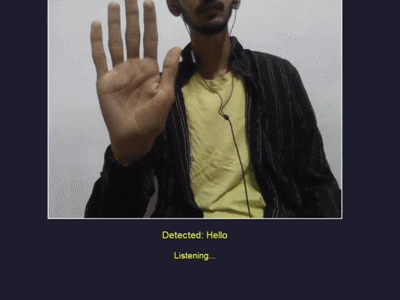
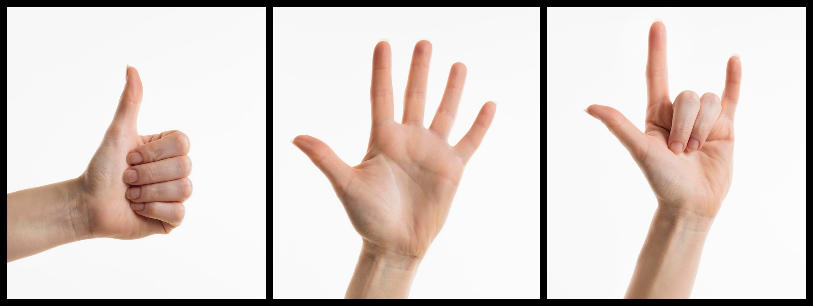
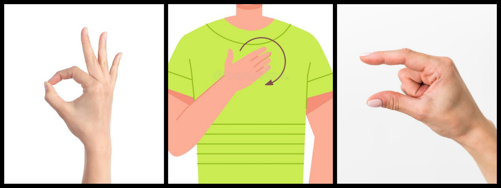

<div align="center">
  <h1 style="color:#4B0082;">🤟 SpeakWithHands</h1>
  <h4 style="color:#483D8B;">Sign Language Recognition System with Voice Assistant</h4>
  <p>
    &nbsp;
    &nbsp;
    
  </p>
</div>

---

## 🎥 Demo

<div align="center">
  
</div>

---

## 📌 About the Project

I developed **SpeakWithHands** to address the communication challenges faced by individuals with hearing or speech impairments. By combining real-time computer vision and deep learning, the system can accurately detect and classify specific hand gestures—such as “Hello,” “OK,” “No,” “Yes,” “I Love You,” and “Please”—and convert them into both on-screen text and spoken words via a voice assistant.

Key motivations and features:

- **Accessibility & Inclusion**: Enables non-verbal users to communicate naturally with others using universally recognizable hand gestures.
- **Customizable Training**: Users collect and label their own gesture images, train the model locally, and achieve personalized accuracy depending on their environment and camera setup.
- **Real-Time Performance**: Leverages MediaPipe for efficient hand tracking and a lightweight MobileNetV2-based model for fast inference on typical consumer hardware.
- **Voice Assistant Integration**: Provides auditory feedback and allows hands-free operation with voice commands (e.g., “Open model,” “Close model”).
- **User-Friendly UI**: A multi-page, animated Tkinter interface guides users through dataset preparation, model training, and live gesture recognition, offering an intuitive experience even for non-technical users.

This detailed approach ensures that **SpeakWithHands** is not only a powerful technical solution but also an approachable tool for anyone looking to enhance interpersonal communication through technology.

---

## 📸 Sample Signs

<!-- Collage 2 on top -->
<div align="center">
  
</div>
<p align="center">
  <strong>Yes</strong>&nbsp;&nbsp;&nbsp;&nbsp;&nbsp;&nbsp;&nbsp;&nbsp;&nbsp;&nbsp;&nbsp;&nbsp;&nbsp;&nbsp;&nbsp;&nbsp;&nbsp;&nbsp;&nbsp;&nbsp;&nbsp;&nbsp;&nbsp;&nbsp;&nbsp;&nbsp;&nbsp;&nbsp;&nbsp;&nbsp;&nbsp;&nbsp;<strong>Hello</strong>&nbsp;&nbsp;&nbsp;&nbsp;&nbsp;&nbsp;&nbsp;&nbsp;&nbsp;&nbsp;&nbsp;&nbsp;&nbsp;&nbsp;&nbsp;&nbsp;&nbsp;&nbsp;&nbsp;&nbsp;&nbsp;&nbsp;&nbsp;&nbsp;&nbsp;&nbsp;&nbsp;&nbsp;&nbsp;&nbsp;&nbsp;&nbsp;<strong>I Love You</strong>
</p>

<!-- Collage 1 below -->
<div align="center">
  
</div>
<p align="center">
  <strong>OK</strong>&nbsp;&nbsp;&nbsp;&nbsp;&nbsp;&nbsp;&nbsp;&nbsp;&nbsp;&nbsp;&nbsp;&nbsp;&nbsp;&nbsp;&nbsp;&nbsp;&nbsp;&nbsp;&nbsp;&nbsp;&nbsp;&nbsp;&nbsp;&nbsp;&nbsp;&nbsp;&nbsp;&nbsp;&nbsp;&nbsp;&nbsp;&nbsp;<strong>Please</strong>&nbsp;&nbsp;&nbsp;&nbsp;&nbsp;&nbsp;&nbsp;&nbsp;&nbsp;&nbsp;&nbsp;&nbsp;&nbsp;&nbsp;&nbsp;&nbsp;&nbsp;&nbsp;&nbsp;&nbsp;&nbsp;&nbsp;&nbsp;&nbsp;&nbsp;&nbsp;&nbsp;&nbsp;&nbsp;&nbsp;&nbsp;<strong>No</strong>
</p>

---

## 🧑‍💻 How to Run

```bash
# 1. Clone the repository
 git clone https://github.com/krishnaxshukla/SpeakWithHands-Sign-Language-Recognition-System-with-Voice-Assistant.git

# 2. Enter the project folder
 cd SpeakWithHands-Sign-Language-Recognition-System-with-Voice-Assistant

# 3. Train the model with your own gesture images
 python scripts/train_model.py

# 4. Run the application
 python app.py
````

---

## 🙋‍♂️ Author

**Krishna Shukla** <hr>
📧 [itsmekrisshna@gmail.com](mailto:itsmekrisshna@gmail.com) <br>
🔗 [LinkedIn](https://www.linkedin.com/in/krishnashukla108)

> Thank you for exploring this project — where hands speak and technology listens. 💜
